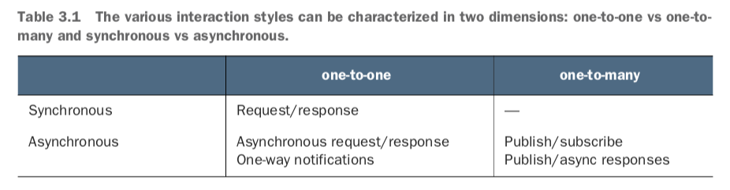
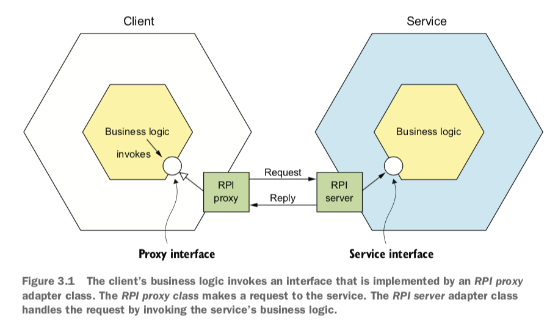
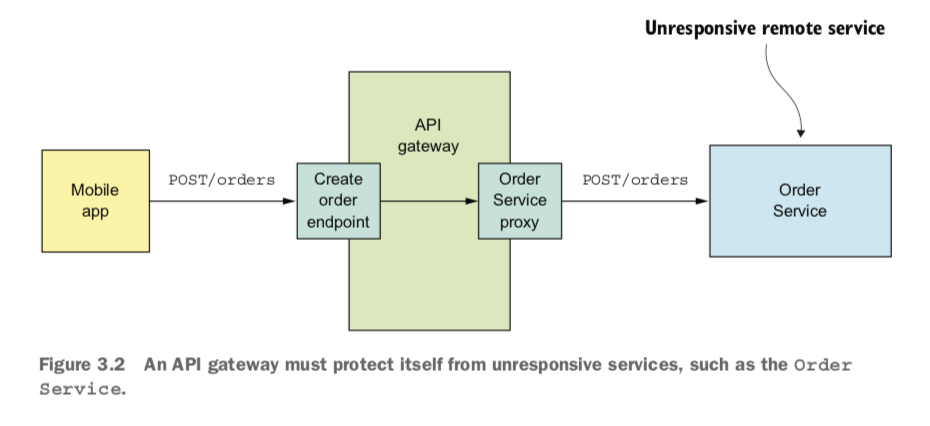
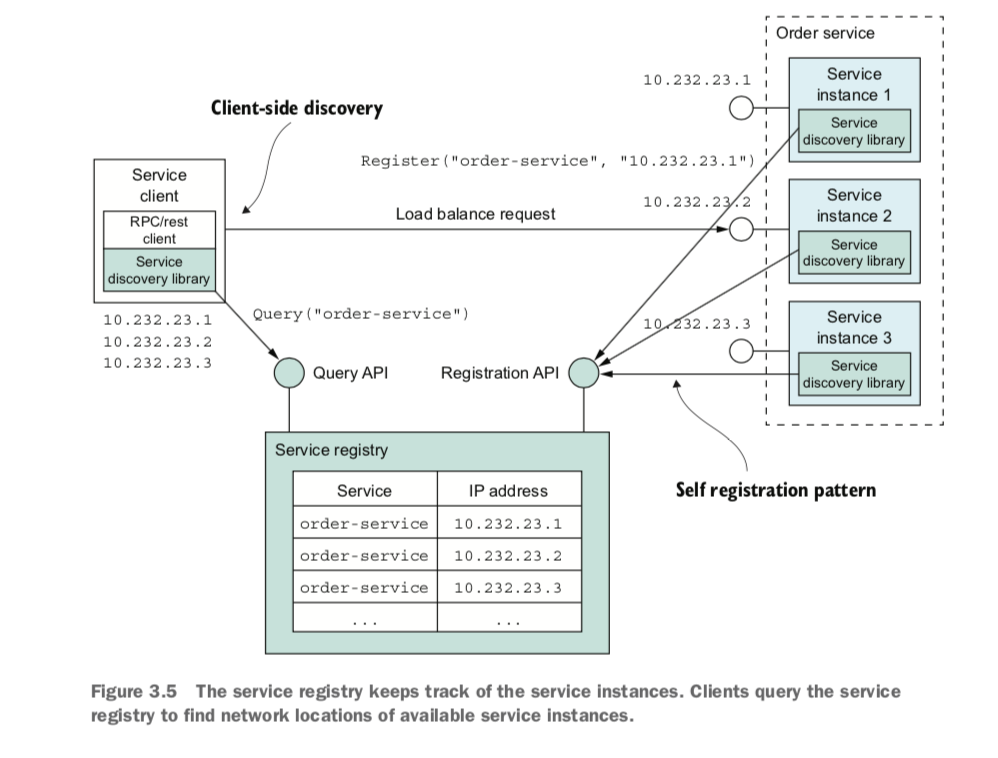
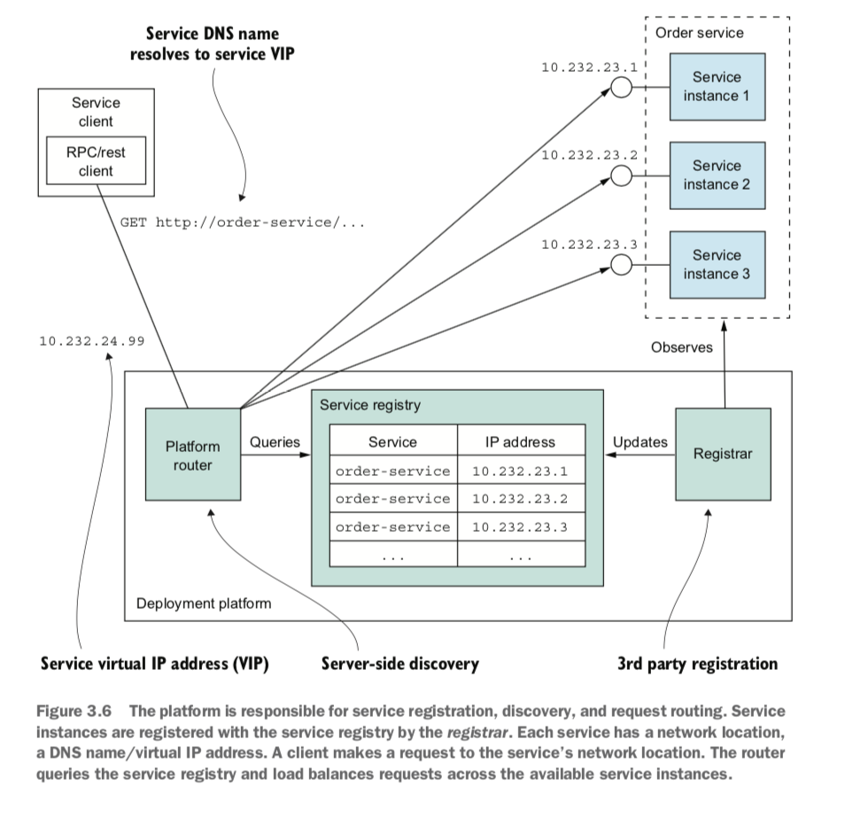
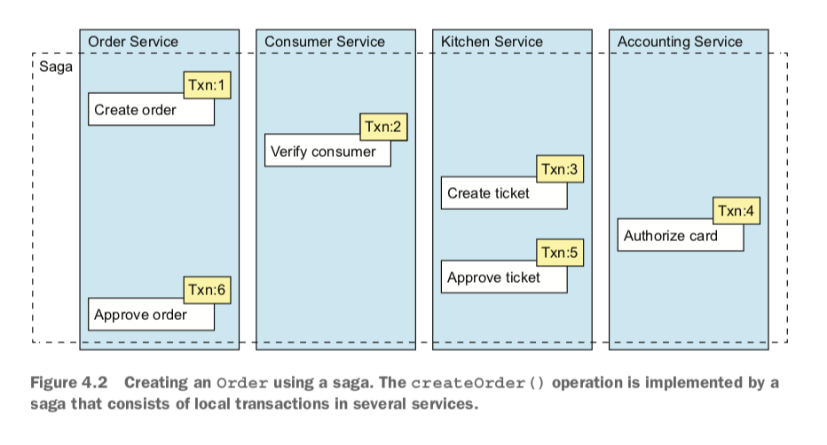
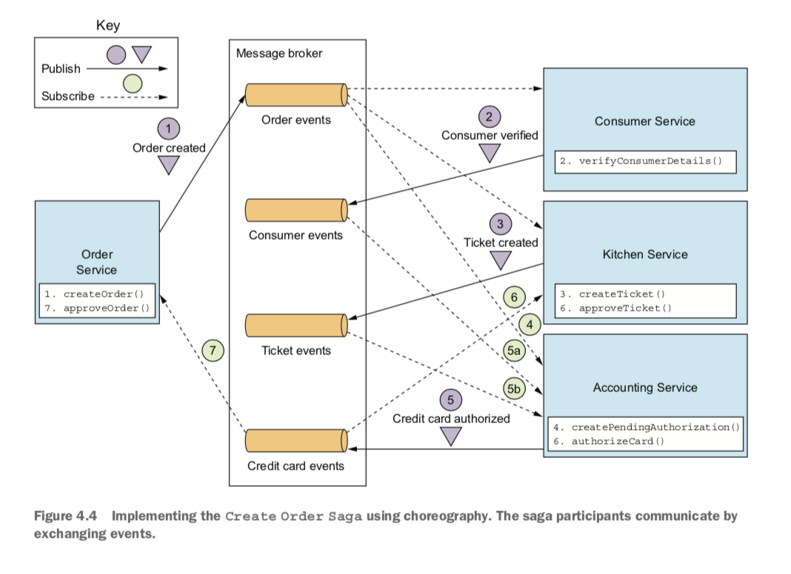
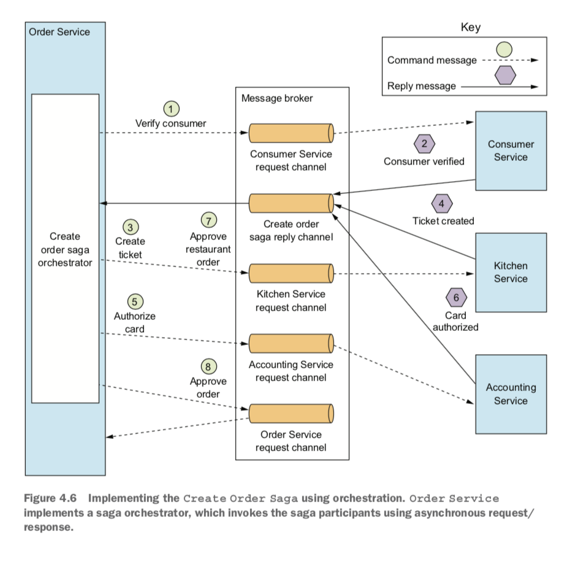
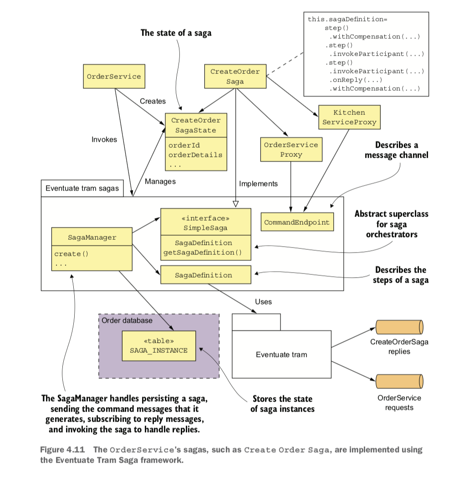
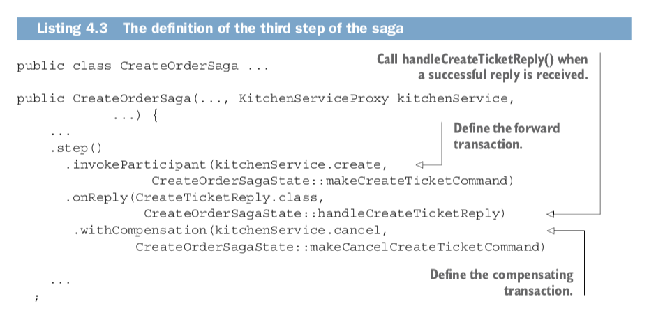

# Microservices Patterns - Week 2 (Liz)

## Chapter 3: **_Interprocess communication in a microservice architecture_**

### This chapter covers

* Applying the communication patterns: Remote procedure invocation, Circuit breaker, Client-side discovery, Self registration, Server-side discovery, Third party registration, Asynchronous messaging, Transactional outbox, Transaction log tailing, Polling publisher

* The importance of interprocess communication in a microservice architecture

* Defining and evolving APIs

* The various interprocess communication options and their trade-offs

* The benefits of services that communicate using asynchronous messaging

* Reliably sending messages as part of a database transaction 

### Chapter Summary

* The microservice architecture is a distributed architecture, so interprocess communication plays a key role.

* It’s essential to carefully manage the evolution of a service’s API. Backward- compatible changes are the easiest to make because they don’t impact clients. If you make a breaking change to a service’s API, it will typically need to support both the old and new versions until its clients have been upgraded.

* There are numerous IPC technologies, each with different trade-offs. One key design decision is to choose either a synchronous remote procedure invocation pattern or the asynchronous Messaging pattern. Synchronous remote procedure invocation-based protocols, such as REST, are the easiest to use. But services should ideally communicate using asynchronous messaging in order to increase availability.

* In order to prevent failures from cascading through a system, a service client that uses a synchronous protocol must be designed to handle partial failures, which are when the invoked service is either down or exhibiting high latency. In particular, it must use timeouts when making requests, limit the number of outstanding requests, and use the Circuit breaker pattern to avoid making calls to a failing service.

* An architecture that uses synchronous protocols must include a service discovery mechanism in order for clients to determine the network location of a service instance. The simplest approach is to use the service discovery mechanism implemented by the deployment platform: the Server-side discovery and 3rd party registration patterns. But an alternative approach is to implement service discovery at the application level: the Client-side discovery and Self registration patterns. It’s more work, but it does handle the scenario where services are running on multiple deployment platforms.

* A good way to design a messaging-based architecture is to use the messages and channels model, which abstracts the details of the underlying messaging system. You can then map that design to a specific messaging infrastructure, which is typically message broker–based.

* One key challenge when using messaging is atomically updating the database and publishing a message. A good solution is to use the Transactional outbox pattern and first write the message to the database as part of the database transaction. A separate process then retrieves the message from the database using either the Polling publisher pattern or the Transaction log tailing pattern and publishes it to the message broker.

**Interaction Styles** (between a service and its clients)			

*One-to-one*—Each client request is processed by exactly one service. 

*One-to-many*—Each request is processed by multiple services. 

*Synchronous*—The client expects a timely response from the service and might even block while it waits.

*Asynchronous*—The client doesn’t block, and the response, if any, isn’t necessarily sent immediately. 			

**one-to-one interactions**

*Request/response*—A service client makes a request to a service and waits for a response. The client expects the response to arrive in a timely fashion. It might event block while waiting. This is an interaction style that generally results in services being tightly coupled.
*Asynchronous request/response*—A service client sends a request to a service, which replies asynchronously. The client doesn’t block while waiting, because the service might not send the response for a long time.

*One-way notifications*—A service client sends a request to a service, but no reply is expected or sent. 

**one-to-many interactions**

*Publish/subscribe*—A client publishes a notification message, which is consumed by zero or more interested services.

*Publish/async responses*—A client publishes a request message and then waits for a certain amount of time for responses from interested services. 

### APIs!

* API-first to designing services: [handy blog post](https://www.programmableweb.com/news/how-to-design-great-apis-api-first-design-and-raml/how-to/2015/07/10)

* APIs change and that’s okay. Ideally these changes will be backwards compatible. 

* There is a [Semantic Versioning](https://semver.org/) standard which sets rules on who to version an API

    * MAJOR—When you make an incompatible change to the API

    * MINOR—When you make backward-compatible enhancements to the API

    * PATCH—When you make a backward-compatible bug fix 

### Using REST

* [Maturity Model for REST](https://martinfowler.com/articles/richardsonMaturityModel.html)

* Pattern: [Remote procedure invocation](http://microservices.io/patterns/communication-style/ messaging.html): A client invokes a service using a synchronous, remote procedure invocation-based protocol, such as REST. 

* Benefits of REST

    * It’s simple and familiar.

    * You can test an HTTP API from within a browser using, for example, the Postman plugin, or from the command line using curl (assuming JSON or some other text format is used).

    * It directly supports request/response style communication.

    * HTTP is, of course, firewall friendly.

    * It doesn’t require an intermediate broker, which simplifies the system’s architecture.

* Drawbacks of REST

    * It only supports the request/response style of communication.

    * Reduced availability. Because the client and service communicate directly without an intermediary to buffer messages, they must both be running for the duration of the exchange.

### Using gRPC

* [gRPC](http://www.grpc.io) is a binary message-based protocol and framework for writing cross-language clients and servers

* gRPC Benefits

    * It’s straightforward to design an API that has a rich set of update operations.

    * It has an efficient, compact IPC mechanism, especially when exchanging large messages.

    * Bidirectional streaming enables both RPI and messaging styles of communication.

    * It enables interoperability between clients and services written in a wide range of languages.						

* gRPC Shortcomings

    * It takes more work for JavaScript clients to consume gRPC-based API than REST/JSON-based APIs.

    * Older firewalls might not support HTTP/2.

### Handling Partial Failure

* It’s important to build your API with partial failure in mind

* Possible workarounds include network timeouts, limiting the number of outstanding requests from a client to a service and using the circuit breaker pattern

* Pattern: [Circuit breaker](http://microservices.io/patterns/reliability/circuit-breaker.htm): An RPI proxy that immediately rejects invocations for a timeout period after the number of consecutive failures exceeds a specified threshold.

### Service Discovery

Two ways to handle service discovery

1. The services and their clients interact directly with the service registry.

2. The deployment infrastructure handles service discovery.

**Application-Level Service Discovery Patterns**

Example is a combination of two patterns: self registration and client-side discovery

Pattern: [Self registration](http://microservices.io/patterns/self-registration.htm): A service instance registers itself with the service registry. 

Pattern: [Client-side discovery](http://microservices.io/patterns/client- side-discovery.html): A service client retrieves the list of available service instances from the service registry and load balances across them.	

**Platform-Provided Service Discovery Patterns**

Examples combines two patterns: 

		

Pattern: [3rd party registration](http://microservices.io/patterns/3rd-party-registration.html): Service instances are automatically registered with the service registry by a third party.				

Pattern: [Server-side discovery](http://microservices.io/patterns/server-side-discovery.html): A client makes a request to a router, which is responsible for service discovery. 

### Asynchronous Messaging

* Services communicate by asynchronously exchanging messages. A messaging-based application typically uses a *message broker*, which acts as an intermediary between the services, although another option is to use a brokerless architecture, where the services communicate directly with each other.

* A message consists of a header (metadata and optional return address) and a body (data sent)

* Messages are exchanged over channels (either [point-to-point](http://www.enterpriseintegrationpatterns.com/PointToPointChannel.html) or [publish-subscribe](http://www.enterpriseintegration-patterns.com/PublishSubscribeChannel.html))

**Types of messages**

*Document*—A generic message that contains only data. The receiver decides how to interpret it. The reply to a command is an example of a document message.

*Command*—A message that’s the equivalent of an RPC request. It specifies the operation to invoke and its parameters.

*Event*—A message indicating that something notable has occurred in the sender. An event is often a domain event, which represents a state change of a domain object such as an Order, or a Customer. 

Popular Open Source Message Brokers: [ActiveMQ](http://activemq.apache.org), [RabbitMQ](https://www.rabbitmq.com), [Apache Kafka](http://kafka.apache.org)

### Transactional Messaging			

* because distributed transactions aren’t a good choice for modern apps, we need an alternative

* Suggested Patterns

    * Pattern: [Transactional outbox](http://microservices.io/patterns/data/transactional-out- box.html): Publish an event or message as part of a database transaction by saving it in an OUTBOX in the database.

    * Pattern: [Polling publisher](http://microservices.io/patterns/data/polling-publisher.html): Publish messages by polling the outbox in the database.

    * Pattern: [Transaction log tailing](http://microservices.io/patterns/data/transaction-log-tailing.html): Publish changes made to the database by tailing the transaction log.

Eliminating Synchronous Interaction	

* Synchronous communication reduces availability :(

* How to minimize synchronous interaction

    1. Use asynchronous interaction styles

    2. Replicate data

    3. Finish processing after returning a response*			*

## Chapter 4: **_Managing transactions with sagas_**

*This chapter covers*

* Why distributed transactions aren’t a good fit for modern applications

* Using the Saga pattern to maintain data consistency in a microservice architecture

* Coordinating sagas using choreography and orchestration

* Using countermeasures to deal with the lack of isolation

### Chapter Summary

* Some system operations need to update data scattered across multiple services. Traditional, XA/2PC-based distributed transactions aren’t a good fit for modern applications. A better approach is to use the Saga pattern. A saga is sequence of local transactions that are coordinated using messaging. Each local transaction updates data in a single service. Because each local transaction commits its changes, if a saga must roll back due to the violation of a business rule, it must execute compensating transactions to explicitly undo changes.

* You can use either choreography or orchestration to coordinate the steps of a saga. In a choreography-based saga, a local transaction publishes events that trigger other participants to execute local transactions. In an orchestration-based saga, a centralized saga orchestrator sends command messages to participants telling them to execute local transactions. You can simplify development and testing by modeling saga orchestrators as state machines. Simple sagas can use choreography, but orchestration is usually a better approach for complex sagas.

* Designing saga-based business logic can be challenging because, unlike ACID transactions, sagas aren’t isolated from one another. You must often use countermeasures, which are design strategies that prevent concurrency anomalies caused by the ACD transaction model. An application may even need to use locking in order to simplify the business logic, even though that risks deadlocks.

**Why are transactions important?**

Transactions are an essential ingredient of every enterprise application. Without transactions it would be impossible to maintain data consistency. 				

### Sagas 

* Sagas are mechanisms to maintain data consistency in a microservice architecture without having to use distributed transactions. You define a saga for each system command that needs to update data in multiple services. A saga is a sequence of local transactions. Each local transaction updates data within a single service using the familiar ACID transaction frameworks and libraries. The system operation initiates the first step of the saga. The completion of a local transaction triggers the execution of the next local transaction. 

* Transactions that span a single service can be ACID (Atomicity, Consistency, Isolation, Durability)

* An operation that spans multiple services must use something called a saga

    * Sagas are ACD (Atomicity, Consistency, Durability), which means they lack isolation

    * Application must use what are known as *countermeasures*, design techniques that prevent or reduce the impact of concurrency anomalies caused by the lack of isolation.

    * Sagas use compensating transactions to roll back changes

Example: the Create Order Saga			

					

### Coordinating Sagas

**different ways to structure a saga’s coordination logic **

1. Choreography—Distribute the decision making and sequencing among the saga participants. They primarily communicate by exchanging events.

* Benefits

    * Simplicity—Services publish events when they create, update, or delete business objects.

    * Loose coupling —The participants subscribe to events and don’t have direct knowledge of each other.

* Drawbacks

    * More difficult to understand

    * Cyclic dependencies between services

    * Risk or tight coupling

2. Orchestration—Centralize a saga’s coordination logic in a saga orchestrator class. A saga orchestrator sends command messages to saga participants telling them which operations to perform

* Benefits

    * Simpler dependencies

    * Less coupling

    * Improves separation of concerns and simplifies business logic

* Drawbacks

    * The risk of centralizing too much logic in the orchestrator
	 		

### Modeling Saga Orchestrators as State Machines				

A good way to model a saga orchestrator is as a state machine. A *state machine *consists of a set of states and a set of transitions between states that are triggered by events. Each transition can have an action, which for a saga is the invocation of a saga participant. The transitions between states are triggered by the completion of a local transaction performed by a saga participant. The current state and the specific outcome of the local transaction determine the state transition and what action, if any, to perform.	

**_** Bottom line: Orchestration is recommended for all but the simplest sagas **_**

### Handling Lack of Isolation

Problem: The lack of isolation potentially causes what the database literature calls *anomalies*. An anomaly is when a transaction reads or writes data in a way that it wouldn’t if transactions were executed one at time. 	

**Anomaly Types**

1. Lost updates

2. Dirty reads

3. Fuzzy/nonrepeatable reads

**Countermeasures**

* Semantic lock—An application-level lock.

* Commutative updates—Design update operations to be executable in any order.

* Pessimistic view—Reorder the steps of a saga to minimize business risk.

* Reread value—Prevent dirty writes by rereading data to verify that it’s unchanged before overwriting it.

* Version file—Record the updates to a record so that they can be reordered.

* By value—Use each request’s business risk to dynamically select the concur-
rency mechanism.

**Saga Structure**

*Compensatable transactions*—Transactions that can potentially be rolled back using a compensating transaction.

*Pivot transaction*—The go/no-go point in a saga. If the pivot transaction commits, the saga will run until completion. A pivot transaction can be a transaction that’s neither compensatable nor retriable. Alternatively, it can be the last compensatable transaction or the first retriable transaction.

*Retriable transactions*—Transactions that follow the pivot transaction and are guaranteed to succeed.

### Example: Order Service and the Create Order Saga

**Responsibilities**

* *CreateOrderSaga*—A singleton class that defines the saga’s state machine. It invokes the CreateOrderSagaState to create command messages and sends them to participants using message channels specified by the saga participant proxy classes, such as KitchenServiceProxy.

* *CreateOrderSagaState*—A saga’s persistent state, which creates command messages.

* *Saga participant proxy classes, *such *as *KitchenServiceProxy—Each proxy class defines a saga participant’s messaging API, which consists of the command channel, the command message types, and the reply types. 

**Illustratration of both forward and compensating transactions**

### Questions / Observations:

* If we went for an API-first approach, what would that look like for us? Could there be a software design phase? Does that work with Agile?

* The author talks a lot about using Java, GoLang, and .NET for microservices. How are we thinking about our future services? Will they be all Elixir? Will there be other languages? (Is Ruby dead???)

* With all this hexagonal design, is anyone else reminded of Settlers of Catan?

* What REST level are we? Also, what’s the deal with HATEOAS? Do people actually want that? It sounds insane. 

* Are there places in our codebase where we should be using a circuit-breaker pattern right now?

* Regarding the service discovery, is that because we would want to communicate over  a private network rather than a public one?

* Would sagas and their orchestrators live in more than one service? For example, would accounting perform some kind of operation that affects order and kitchens? 

* What communication styles do we currently use?

* Where do we think our communication between apps / services could be improved?

* Has anyone worked with gRPC? This was a new concept for me

* Do we use both application-level and platform-provided service discovery in our ecosystem?

* Really like the idea of compensating actions and modeling saga orchestration a state machines. I feel like having this explicitly documented in the code would lead to more legible code intent

View <a href='https://learn.co/lessons/microservices-patterns-chapters-3-4'>Microservices Patterns - Chapters 3 & 4</a> on Learn.co and start learning to code for free.

